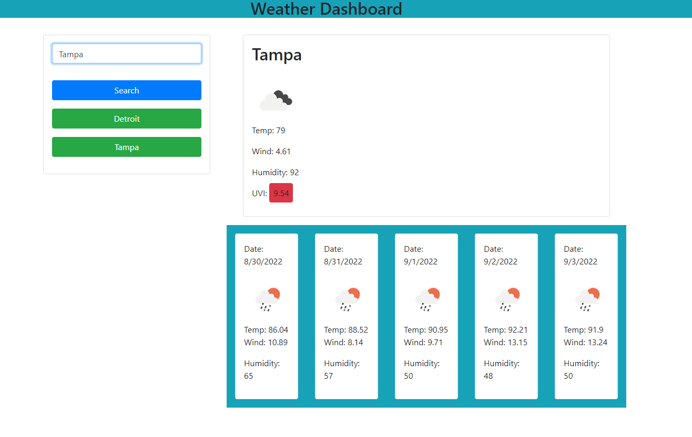

# weather-dashboard

## Table of Contents
1. [Description](#description)
2. [Technology](#technology)
3. [Visuals](#visuals)
4. [License](#license)

# Description
[Link to Live Site](https://zachattack221.github.io/weather-dashboard/)
\
The purpose of this application is to provide an interactive space to search weather conditions by city, displaying not only current information, but also a five day forecast. This project serves as an exercise in API requests, use of local storage, and the use of outside frameworks for styling (Bootstrap v4.6). Ultimately, the JS is utilized to drive the functionality of the page, allowing for variable manipulation and event delegation, providing the user with a clean display of requested weather data.

## Technology
This Application utilizes an open source Weather API, serving requests when triggered/searched. Bootstrap utilized for interactive styling (such as a color dependant display for a given city's UV index based on pre-coded ranges). JavaScript based application that uses a document model to create and update html elements based on search criteria results. Leverages local storage to retain previous searches, and event listeners linked to api requests.

# Visuals

## License
This application is licensed with the MIT License.